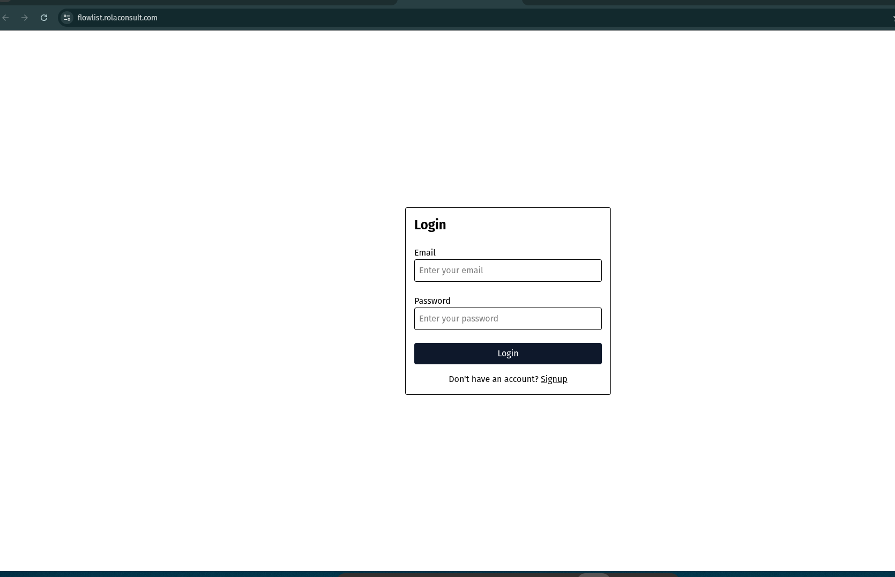
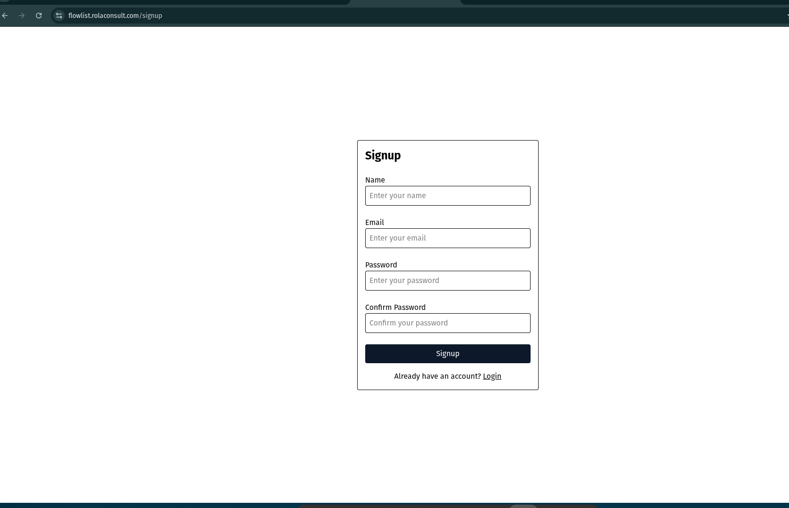
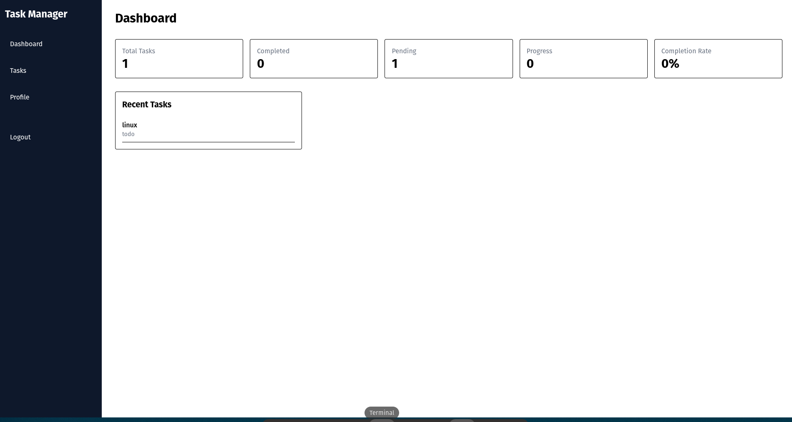

# Flowlist 📝

> A full-stack task management application built with the MERN stack — featuring JWT authentication, search, filtering, sorting, and a live deployment on a VPS with Docker and HTTPS.

---


## 🌐 Live Demo

**[https://flowlist.rolaconsult.com](https://flowlist.rolaconsult.com)**

Deployed on an Ubuntu VPS with Docker Compose, Nginx reverse proxy, and Let's Encrypt SSL.

---

## 🔑 Demo Account

For evaluator testing:

Email: demo@example.com
Password: Demo123@

Alternatively, users can create their own account using the Signup page.

---

## 🎯 Project Goals

This project was built to practice:

- Full-stack MERN development
- JWT authentication
- REST API design
- Docker containerization
- Nginx reverse proxy configuration
- Linux VPS deployment
- HTTPS with Let's Encrypt

---

## 🔑 Key Highlights

- MERN Stack Application
- JWT Authentication
- Search / Filter / Sort
- Dockerized Architecture
- Nginx Reverse Proxy
- HTTPS with Let's Encrypt
- Linux VPS Deployment

---

## 📸 Screenshots

| Login                             | Signup                              |
| --------------------------------- | ----------------------------------- |
|  |  |

| Dashboard                                 | Tasks                                    |
| ----------------------------------------- | ---------------------------------------- |
|  |  |

---

## ✨ Features

- 🔐 **JWT Authentication** — Secure signup, login, and logout
- 🛡️ **Protected Routes** — Client and server side route protection
- ✅ **Task CRUD** — Create, read, update, and delete tasks
- 🔍 **Search** — Find tasks by title instantly
- 🎛️ **Filter & Sort** — Filter by status/priority, sort by date or priority
- 📊 **Dashboard Statistics** — Overview of task counts by status
- 📱 **Responsive UI** — Works on desktop and mobile
- 🐳 **Dockerized** — Full Docker Compose setup for local and production

---

## 🧰 Tech Stack

### Frontend

| Technology   | Purpose                                |
| ------------ | -------------------------------------- |
| React 19     | UI framework                           |
| Vite         | Build tool & dev server                |
| Tailwind CSS | Styling                                |
| React Router | Client-side routing & protected routes |
| Axios        | HTTP client                            |

### Backend

| Technology             | Purpose                    |
| ---------------------- | -------------------------- |
| Node.js 20             | Runtime                    |
| Express 5              | Web framework              |
| MongoDB                | Database                   |
| Mongoose               | ODM                        |
| JSON Web Token         | Authentication             |
| Zod                    | Request validation         |
| Helmet                 | Security headers           |
| express-rate-limit     | Rate limiting              |
| express-mongo-sanitize | NoSQL injection prevention |

### Infrastructure

| Technology              | Purpose                         |
| ----------------------- | ------------------------------- |
| Docker + Docker Compose | Containerization                |
| Nginx                   | Reverse proxy + SSL termination |
| Let's Encrypt           | Free SSL/TLS certificates       |
| Ubuntu VPS              | Production hosting              |

---

## 🎯 Skills Demonstrated

- React
- Express 5
- MongoDB
- JWT Authentication
- Protected Routes
- REST API Design
- Docker
- Docker Compose
- Nginx Reverse Proxy
- HTTPS / SSL (Let's Encrypt)
- Linux VPS Deployment
- Environment Configuration

---

## 📁 Project Structure

```
Flowlist/
├── Client/                        # React frontend
│   ├── src/
│   │   ├── components/            # Reusable UI components
│   │   ├── pages/                 # Route-level pages
│   │   └── config/api.js          # Axios base config
│   ├── Dockerfile
│   └── .env.example
├── Server/                        # Express backend
│   ├── src/
│   │   ├── controllers/           # Route handlers
│   │   ├── models/                # Mongoose schemas
│   │   ├── routes/                # Express routers
│   │   ├── middleware/            # Validation middleware
│   │   ├── validators/            # Zod schemas
│   │   └── utils/                 # AppError, ApiFeatures
│   ├── Dockerfile
│   └── .env.example
├── docker-compose.yml
└── setup.sh                       # Env file setup script
```

---

## 🏗️ Architecture Overview

```
Browser
  │
  ▼
Nginx (Reverse Proxy + SSL)
  ├── /api/v1/* ──▶ Express Server (4000)
  │                     │
  │                     ▼
  │                MongoDB
  │
  └── /* ─────────▶ React Frontend (5173)
```

All services run inside Docker containers on the same internal network. Nginx is the only public entry point — it handles HTTPS and routes traffic to the correct container.

---

## 🌐 API Overview

All endpoints prefixed with `/api/v1`

### Auth

| Method | Endpoint       | Description              | Auth |
| ------ | -------------- | ------------------------ | ---- |
| POST   | `/auth/signup` | Register new user        | ❌   |
| POST   | `/auth/login`  | Login, receive JWT       | ❌   |
| POST   | `/auth/logout` | Logout                   | ❌   |
| GET    | `/auth/me`     | Get current user profile | ✅   |

### Tasks

| Method | Endpoint       | Description                          | Auth |
| ------ | -------------- | ------------------------------------ | ---- |
| GET    | `/tasks`       | Get all tasks (search, filter, sort) | ✅   |
| POST   | `/tasks`       | Create a task                        | ✅   |
| GET    | `/tasks/:id`   | Get single task                      | ✅   |
| PATCH  | `/tasks/:id`   | Update a task                        | ✅   |
| DELETE | `/tasks/:id`   | Delete a task                        | ✅   |
| GET    | `/tasks/stats` | Get dashboard statistics             | ✅   |

---

## ⚙️ Environment Variables

### Server — `Server/src/config.env`

```env
PORT=4000
MONGO_URI=mongodb://localhost:27017/Flowlist
JWT_SECRET=your_super_secret_key
JWT_EXPIRES_IN=7d
CLIENT_URL=http://localhost:5173
```

> Generate a secure JWT secret:
>
> ```bash
> node -e "console.log(require('crypto').randomBytes(64).toString('hex'))"
> ```

### Client — `Client/.env`

```env
VITE_API_URL=http://127.0.0.1:4000/api/v1
```

---

## ⚡ Prerequisites

| Tool                    | Manual | Docker |
| ----------------------- | :----: | :----: |
| Node.js v20+            |   ✅   |   ❌   |
| MongoDB                 |   ✅   |   ❌   |
| Docker + Docker Compose |   ❌   |   ✅   |

---

## 🛠️ Option 1 — Manual Setup

### 1. Clone the repo

```bash
git clone https://github.com/rola-infra/Flowlist.git
cd Flowlist
```

### 2. Setup Server

```bash
cd Server
cp .env.example src/config.env
```

Edit `src/config.env` and set your values — especially `JWT_SECRET`.

```bash
npm install
npm run dev
```

✅ Server → `http://localhost:4000`

### 3. Setup Client

Open a new terminal:

```bash
cd Client
cp .env.example .env
```

Default `.env` value works for local — no changes needed.

```bash
npm install
npm run dev
```

✅ Client → `http://localhost:5173`

### 4. Start MongoDB

```bash
# Linux
sudo systemctl start mongod

# Mac
brew services start mongodb-community
```

Open browser → `http://localhost:5173` 🎉

---

## 🐳 Option 2 — Docker Setup

> **Note:** Docker and Docker Compose must already be installed on your machine.
> System-specific Docker configuration is outside the scope of this project.

### 1. Clone the repo

```bash
git clone https://github.com/rola-infra/Flowlist.git
cd Flowlist
```

### 2. Run the setup script

Creates env files from examples automatically:

```bash
bash setup.sh
```

### 3. Set your JWT secret

Open `Server/src/config.env` and set a real value for `JWT_SECRET`.

### 4. Start everything

```bash
docker compose up --build -d
```

View logs:

```bash
docker compose logs -f
```

Open browser → `http://localhost:5173` 🎉

### Docker Commands

```bash
docker compose up --build   # first run or after changes
docker compose up           # restart without rebuild
docker compose up -d        # run in background
docker compose down         # stop all containers
docker compose down -v      # stop and delete all data
docker compose logs -f      # live logs
```

---

## 🚀 Deployment Overview

Production is deployed on an Ubuntu VPS with the following setup:

- **Docker Compose** manages all services (MongoDB, Express, React)
- **Nginx** acts as a reverse proxy — routes `/api/v1/*` to Express, everything else to React
- **Let's Encrypt** provides free SSL via Certbot — all traffic served over HTTPS
- **Environment variables** are injected at runtime, never baked into images

---

## 🔭 Roadmap

- [ ] Refresh token + token rotation
- [ ] GitHub Actions CI/CD pipeline
- [ ] Task due dates and reminders

---

## 📄 License

MIT — free to use for learning or portfolio purposes.
